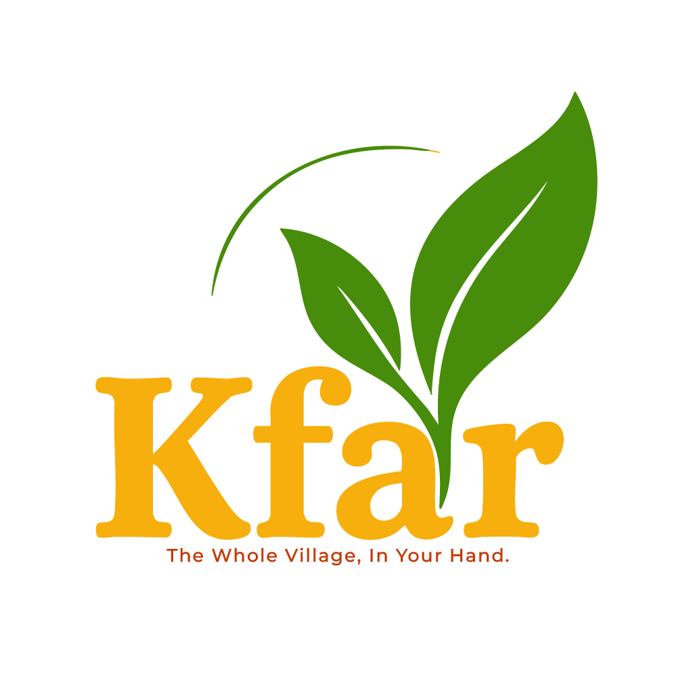

# KFAR Marketplace - Village of Peace Community Platform



## 🌟 Overview

KFAR Marketplace is a comprehensive multi-vendor e-commerce platform designed for the Village of Peace community in Dimona, Israel. The platform facilitates local commerce, supports community currency (Braysheet), and provides bilingual support in Hebrew and English.

**Live Demo**: [https://kfar-final.vercel.app](https://kfar-final.vercel.app)

## 📊 Platform Statistics

- **129 Products** across various categories
- **12 Active Vendors** from the local community
- **Bilingual Support** (Hebrew/English)
- **Multi-Currency** (ILS, Braysheet, USD, EUR)
- **Mobile Responsive** design
- **Real-time Order Management** with WhatsApp notifications

## 🚀 Quick Start

### Prerequisites

- Node.js 18+ and npm
- Supabase account for database
- API keys for translation services (optional)

### Installation

1. **Clone the repository**
```bash
git clone https://github.com/bakiel/kfar-shop.git
cd kfar-shop
```

2. **Install dependencies**
```bash
npm install
```

3. **Set up environment variables**
```bash
cp .env.example .env.local
```

Edit `.env.local` with your credentials:
```env
NEXT_PUBLIC_SUPABASE_URL=your_supabase_url
NEXT_PUBLIC_SUPABASE_ANON_KEY=your_supabase_anon_key
OPENROUTER_API_KEY=your_openrouter_key
DEEPSEEK_API_KEY=your_deepseek_key (optional)
ELEVENLABS_API_KEY=your_elevenlabs_key (optional)
```

4. **Run the development server**
```bash
npm run dev
```

Open [http://localhost:3000](http://localhost:3000) to view the application.

## 🏗️ Technology Stack

### Frontend
- **Next.js 15** - React framework with App Router
- **TypeScript** - Type-safe development
- **Tailwind CSS** - Utility-first styling
- **Shadcn/UI** - Component library
- **React Hook Form** - Form management

### Backend
- **Supabase** - PostgreSQL database & authentication
- **Vercel** - Deployment & hosting
- **WhatsApp Business API** - Order notifications
- **OpenRouter API** - AI-powered translations

### Development Tools
- **ESLint** - Code linting
- **Prettier** - Code formatting
- **Jest** - Testing framework

## 📱 Key Features

### For Customers
- **Product Browsing** - Search and filter 129+ products
- **Multi-Language** - Toggle between Hebrew and English
- **Guest Checkout** - No registration required
- **Order Tracking** - Real-time status updates
- **Multiple Payment Methods** - Credit cards, Braysheet, bank transfer
- **Customer Dashboard** - Order history and profile management

### For Vendors
- **Vendor Dashboard** - Sales analytics and insights
- **Order Management** - Process orders with status updates
- **Product Management** - Add/edit products (coming soon)
- **WhatsApp Notifications** - Instant order alerts
- **Analytics** - Revenue tracking and customer insights
- **Onboarding System** - Streamlined vendor registration

### For Administrators
- **Admin Dashboard** - Platform overview and metrics
- **User Management** - Customer and vendor administration
- **Content Management** - Update platform content
- **Analytics** - Comprehensive business insights

## 🗂️ Project Structure

```
kfar-final/
├── app/                    # Next.js App Router pages
│   ├── api/               # API routes
│   ├── checkout/          # Checkout flow
│   ├── customer/          # Customer portal
│   ├── vendor/            # Vendor portal
│   └── admin/             # Admin portal
├── components/            # React components
│   ├── ui/               # Base UI components
│   ├── layout/           # Layout components
│   ├── home/             # Homepage sections
│   └── vendor/           # Vendor-specific components
├── lib/                   # Utilities and services
│   ├── context/          # React contexts
│   ├── services/         # Business logic
│   ├── supabase/         # Database client
│   └── utils/            # Helper functions
├── public/               # Static assets
│   └── images/          # Images and logos
├── scripts/              # Utility scripts
└── styles/              # Global styles
```

## 📝 Documentation

Comprehensive documentation is available in the following files:

- **[CLAUDE.md](CLAUDE.md)** - AI assistant configuration and guidelines
- **[CLIENT_TESTING_CHECKLIST.md](CLIENT_TESTING_CHECKLIST.md)** - Testing procedures
- **[VENDOR_ONBOARDING_GUIDE.md](VENDOR_ONBOARDING_GUIDE.md)** - Vendor setup guide
- **[Technical Report (PDF)](KFAR_Technical_Report.pdf)** - Complete technical documentation

## 🧪 Testing

### Run Tests
```bash
# Run all tests
npm test

# Run specific test suites
npm run test:api
npm run test:ui
npm run test:integration

# Check system health
node scripts/comprehensive-system-check.js
```

### Test Accounts
- **Customer**: Use `/customer/login`
- **Vendor**: Use `/vendor/login`
- **Admin**: Use `/admin/login`

## 🚀 Deployment

The application is configured for automatic deployment via Vercel:

1. **Push to GitHub**
```bash
git add .
git commit -m "Update: Description of changes"
git push origin main
```

2. **Automatic Deployment**
- Vercel automatically builds and deploys on push to main
- Preview deployments for pull requests
- Live URL: [https://kfar-final.vercel.app](https://kfar-final.vercel.app)

## 🔐 Security

- Environment variables for sensitive data
- Supabase Row Level Security (RLS)
- Secure API endpoints with validation
- HTTPS enforced in production
- Input sanitization and validation

## 🤝 Contributing

We welcome contributions from the community! Please see our contributing guidelines:

1. Fork the repository
2. Create a feature branch (`git checkout -b feature/AmazingFeature`)
3. Commit your changes (`git commit -m 'Add some AmazingFeature'`)
4. Push to the branch (`git push origin feature/AmazingFeature`)
5. Open a Pull Request

## 📞 Support

For support and questions:
- **Technical Issues**: Create an issue on GitHub
- **Business Inquiries**: Contact the Village of Peace administration
- **WhatsApp Support**: Available for vendors

## 📄 License

This project is proprietary software for the Village of Peace community.

## 🙏 Acknowledgments

- Village of Peace community members
- All contributing vendors and customers
- Development team and testers
- Open source community

---

**Built with ❤️ for the Village of Peace Community**