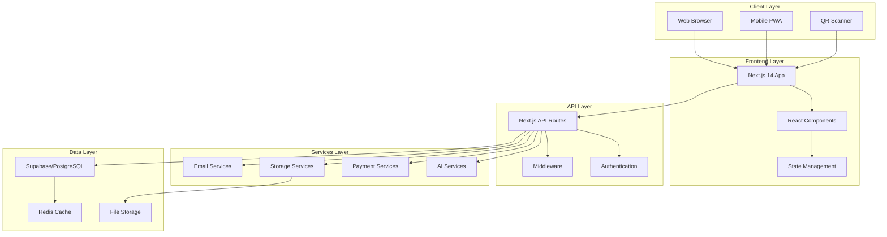
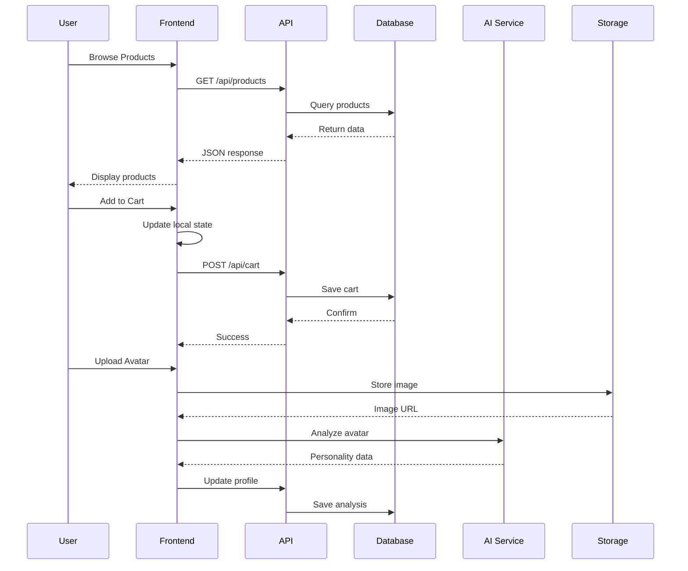
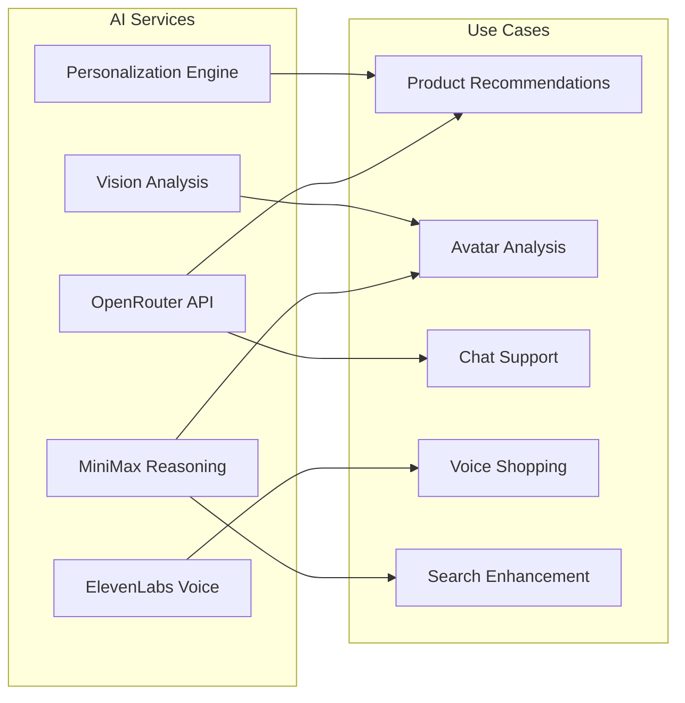
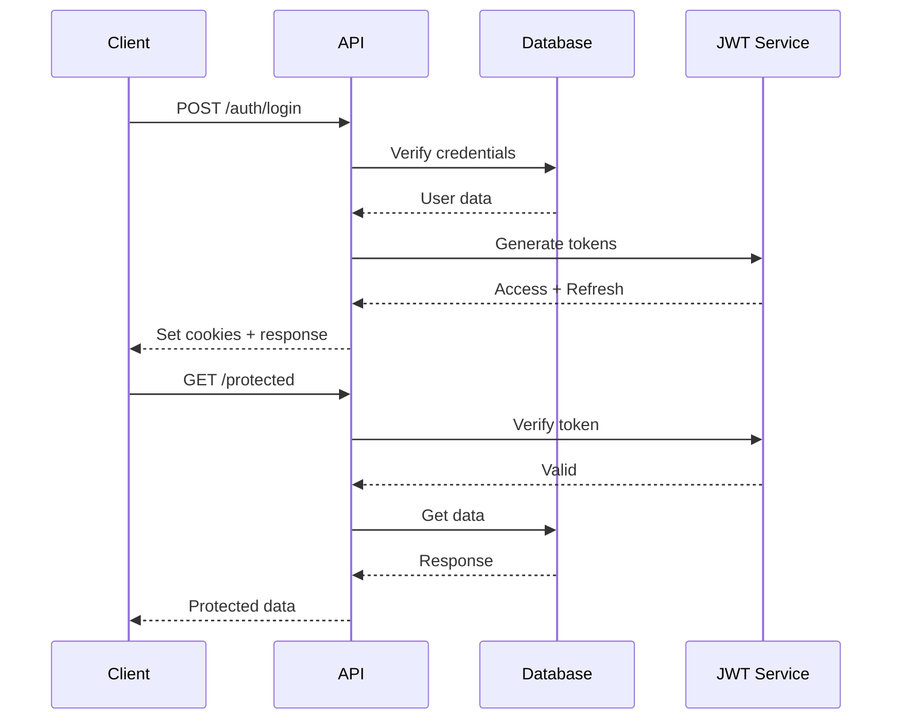
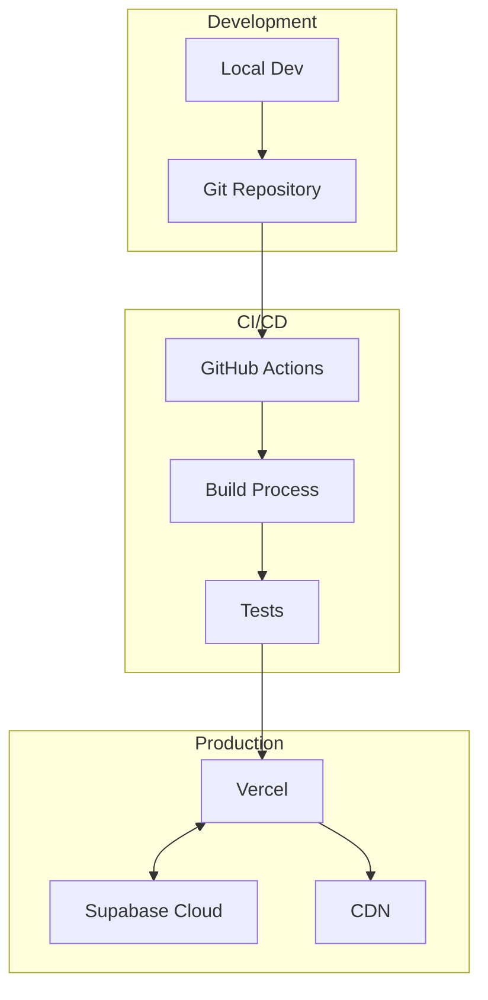

# 🏗️ KFAR Marketplace Architecture Overview

<div align="center">
  
  
  # System Architecture & Technical Design
  ### Complete Technical Documentation
</div>

---

## 🎯 High-Level Architecture



---

## 📁 Project Structure

```
kfar-marketplace/
├── app/                    # Next.js 14 App Router
│   ├── (auth)/            # Authentication routes
│   ├── admin/             # Admin dashboard
│   ├── api/               # API endpoints
│   ├── customer/          # Customer pages
│   ├── marketplace/       # Shopping pages
│   ├── product/           # Product pages
│   ├── vendor/            # Vendor dashboard
│   └── page.tsx           # Homepage
├── components/            # React components
│   ├── chat/             # Chat widgets
│   ├── customer/         # Customer components
│   ├── layout/           # Layout components
│   ├── mobile/           # Mobile-specific
│   ├── qr/               # QR components
│   ├── ui/               # UI library
│   └── vendor/           # Vendor components
├── lib/                   # Core libraries
│   ├── adk/              # AI Development Kit
│   ├── api/              # API clients
│   ├── config/           # Configuration
│   ├── context/          # React contexts
│   ├── data/             # Data layer
│   ├── db/               # Database
│   ├── services/         # Business logic
│   ├── supabase/         # Supabase client
│   └── utils/            # Utilities
├── hooks/                 # Custom React hooks
├── styles/               # Global styles
├── public/               # Static assets
└── database/             # SQL schemas
```

---

## 🔄 Data Flow Architecture



---

## 🗄️ Database Schema

### Core Tables Structure:

```sql
-- Vendors Table
vendors
├── id (PK)
├── name
├── slug
├── description
├── logo_path
├── banner_path
├── contact_info
└── timestamps

-- Products Table
products
├── id (PK)
├── vendor_id (FK)
├── name
├── description
├── price
├── images
├── category
├── dietary_info
├── vision_verification
└── timestamps

-- Customers Table
customers
├── id (PK)
├── email
├── profile_data
├── preferences
├── qr_code
├── avatar_analysis
└── timestamps

-- Orders Table
orders
├── id (PK)
├── customer_id (FK)
├── vendor_id (FK)
├── items (JSON)
├── status
├── payment_info
└── timestamps
```

### Relationships:
- **1 Vendor** → Many Products
- **1 Customer** → Many Orders
- **1 Order** → Many Products (via items JSON)
- **1 Product** → Many Reviews

---

## 🔌 API Architecture

### RESTful Endpoints Structure:

```
/api/
├── auth/
│   ├── login
│   ├── register
│   ├── logout
│   └── refresh
├── customers/
│   ├── GET    /              # List customers
│   ├── POST   /              # Create customer
│   ├── GET    /:id           # Get customer
│   ├── PUT    /:id           # Update customer
│   ├── POST   /onboard       # Onboarding
│   └── GET    /qr/:id        # QR data
├── products/
│   ├── GET    /              # List products
│   ├── POST   /              # Create product
│   ├── GET    /:id           # Get product
│   ├── PUT    /:id           # Update product
│   └── DELETE /:id           # Delete product
├── vendors/
│   ├── GET    /              # List vendors
│   ├── POST   /              # Create vendor
│   ├── GET    /:id           # Get vendor
│   └── PUT    /:id           # Update vendor
├── orders/
│   ├── GET    /              # List orders
│   ├── POST   /              # Create order
│   ├── GET    /:id           # Get order
│   └── PATCH  /:id/status    # Update status
└── ai/
    ├── POST   /chat          # AI chat
    ├── POST   /analyze       # Image analysis
    └── POST   /recommend     # Recommendations
```

---

## 🤖 AI Services Integration



### AI Service Configuration:
```typescript
const aiServices = {
  openrouter: {
    endpoint: 'https://openrouter.ai/api/v1',
    models: ['claude-3', 'gpt-4', 'mixtral'],
    fallback: true
  },
  minimax: {
    endpoint: 'https://api.minimax.chat/v1',
    model: 'abab6.5-chat',
    features: ['reasoning', 'analysis']
  },
  vision: {
    providers: ['claude', 'gemini'],
    features: ['product_verification', 'avatar_analysis']
  }
}
```

---

## 🔐 Security Architecture

### Authentication Flow:



### Security Layers:
1. **Authentication**: JWT with refresh tokens
2. **Authorization**: Role-based access control
3. **Validation**: Input sanitization
4. **Encryption**: HTTPS, bcrypt for passwords
5. **Rate Limiting**: Per-IP and per-user
6. **CORS**: Configured for production domains

---

## 📱 Mobile Architecture

### Progressive Web App Structure:

```
Mobile Features
├── Service Worker
│   ├── Cache strategies
│   ├── Offline support
│   └── Background sync
├── App Manifest
│   ├── Icons
│   ├── Theme colors
│   └── Display modes
├── Mobile Components
│   ├── Bottom navigation
│   ├── Touch gestures
│   └── Native features
└── Responsive Design
    ├── Breakpoints
    ├── Touch targets
    └── Performance
```

---

## 🚀 Deployment Architecture



### Infrastructure:
- **Hosting**: Vercel (Next.js optimized)
- **Database**: Supabase (Managed PostgreSQL)
- **Storage**: Supabase Storage + CDN
- **Domain**: Cloudflare DNS
- **SSL**: Automatic via Vercel
- **Monitoring**: Vercel Analytics

---

## ⚡ Performance Optimization

### Strategies Implemented:

1. **Code Splitting**
   ```typescript
   // Dynamic imports for heavy components
   const QRScanner = dynamic(() => import('@/components/qr/Scanner'))
   ```

2. **Image Optimization**
   ```typescript
   // Next.js Image with lazy loading
   <Image 
     src={product.image}
     loading="lazy"
     placeholder="blur"
   />
   ```

3. **API Caching**
   ```typescript
   // Redis caching layer
   const cached = await redis.get(key)
   if (cached) return cached
   ```

4. **Database Queries**
   ```sql
   -- Optimized with indexes
   CREATE INDEX idx_products_vendor ON products(vendor_id);
   CREATE INDEX idx_products_category ON products(category);
   ```

---

## 🔄 State Management

### Context Architecture:

```typescript
// Global state structure
const AppState = {
  auth: {
    user: User | null,
    token: string | null,
    isAuthenticated: boolean
  },
  cart: {
    items: CartItem[],
    total: number,
    count: number
  },
  ui: {
    theme: 'light' | 'dark',
    language: 'en' | 'he' | 'ar',
    notifications: Notification[]
  },
  preferences: {
    dietary: string[],
    categories: string[],
    vendors: string[]
  }
}
```

---

## 🌐 Integration Points

### External Services:

| Service | Purpose | Status |
|---------|---------|--------|
| **Supabase** | Database & Auth | ✅ Integrated |
| **OpenRouter** | AI Models | ✅ Integrated |
| **ElevenLabs** | Voice Synthesis | ✅ Integrated |
| **Stripe** | Payments | ⏳ Pending |
| **SendGrid** | Email | ⏳ Pending |
| **Twilio** | SMS/WhatsApp | ⏳ Pending |

---

## 📊 Monitoring & Analytics

### Tracking Architecture:

```typescript
// Event tracking system
const analytics = {
  pageView: (page: string) => { /* ... */ },
  event: (category: string, action: string) => { /* ... */ },
  purchase: (order: Order) => { /* ... */ },
  error: (error: Error) => { /* ... */ }
}
```

### Metrics Collected:
- Page views and user flows
- Conversion rates
- API performance
- Error rates
- User engagement
- Revenue tracking

---

## 🔮 Future Architecture Plans

### Planned Enhancements:

1. **Microservices Migration**
   - Separate services for orders, payments, notifications
   - Independent scaling
   - Better fault isolation

2. **Real-time Features**
   - WebSocket for live updates
   - Push notifications
   - Live chat support

3. **Advanced Caching**
   - GraphQL with Apollo
   - Edge caching
   - Predictive prefetching

4. **Machine Learning Pipeline**
   - Recommendation engine
   - Fraud detection
   - Demand forecasting

---

<div align="center">
  <h3>Architecture Principles</h3>
  <p>Scalable • Secure • Maintainable • Performance-First</p>
  <p style="color: #478c0b;">Built for Growth 🚀</p>
</div>